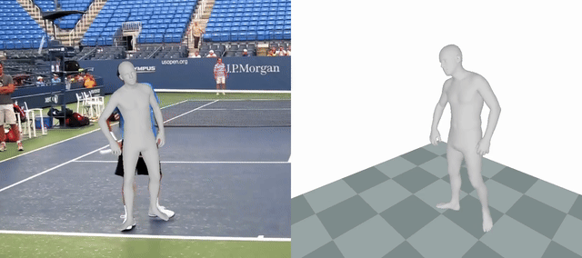
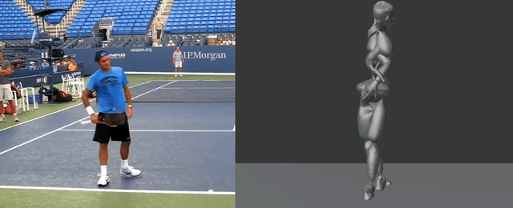
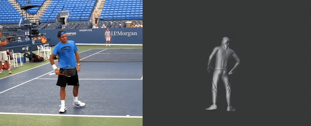

# motion-retarget-poc

영상 속 인물의 동작을 뽑아서 다른 3D 캐릭터에 옮겨보는 기술 검증(POC) 프로젝트.

- 요구사항: [PRD.md](PRD.md)
- 기술 설계: [TECH_SPEC.md](TECH_SPEC.md)
- 리타겟팅 떨림(짐벌락) 원인 규명 전체 기록(심화): [RETARGETING_JITTER_INVESTIGATION.md](RETARGETING_JITTER_INVESTIGATION.md)

## 무엇을 증명했나 (기술 POC 결론)

**"영상 → 3D 모션 추정 → 전혀 다른 3D 캐릭터로 리타겟팅"이 GUI 조작 없이 완전히 스크립트로, 떨림 없는 매끄러운 품질로 end-to-end 가능하다는 걸 증명했다.** GPU 무료 티어(Kaggle)만으로 모션 추정을, 무료 오픈소스 도구(Blender)만으로 리타겟팅을 끝까지 자동화했다. 그 과정에서 만난 문제들(접지 실패, 팔다리 방향 오류, 150°+ 짐벌락, 그리고 마지막까지 남았던 19~60° 잔여 떨림)의 근본 원인을 전부 라이브러리/엔진 코드 수준까지 파고들어 규명·수정했다 — 마지막 잔여 떨림은 후처리로 다듬는 대신 **1단계(SMPL→FBX 변환)를 스무딩 없이 처음부터 직접 재구현**해서 근본적으로 없앴다([RETARGETING_JITTER_INVESTIGATION.md §7](RETARGETING_JITTER_INVESTIGATION.md#7-4차-문제--잔여-떨림을-다듬기가-아니라-처음부터-다시-만들기로-해결-2026-09-24)). **"이 기술이 되는가"라는 POC의 핵심 질문에 그렇다고 답할 수 있는 최종 단계**다.

## 파이프라인 — 따라하기 (지금 기준 가장 깨끗한 경로)

```
영상(테니스 스윙, 10.4초/312프레임)
  ① GVHMR(Kaggle GPU 무료)          → SMPL 3D 모션 파라미터 (hmr4d_results.pt)
  ② compute_smpl_fk.py (스무딩 없는 순수 FK)  → global_mat/transl npz 3종
  ③ export_smpl_source.py (최초 1회) → 레스트 스켈레톤용 SMPL FBX
  ④ rebuild_smpl_fbx_fk.py (Blender) → 순정 SMPL FBX (떨림 없음, 스크린샷 검증)
  ⑤ retarget_onto_mixamo_blender.py (Blender) → Mixamo 캐릭터 FBX (최종 리타겟)
  ⑥ render_stills_fk_retarget.py + ffmpeg(사이트: https://ffmpeg.org/) → 원본과 나란히 비교한 mp4
```

| # | 스크립트 | 실행 환경 | 결과물 |
|---|---|---|---|
| ① | [kaggle/gvhmr_inference_kaggle.ipynb](kaggle/gvhmr_inference_kaggle.ipynb) | [Kaggle](https://www.kaggle.com/)(사이트) GPU | `hmr4d_results.pt` |
| ② | [scripts/compute_smpl_fk.py](scripts/compute_smpl_fk.py) | conda `gvhmr`(torch+scipy) | `smpl_params_fk*.npz` |
| ③ | [scripts/export_smpl_source.py](scripts/export_smpl_source.py) | conda `gvhmr`(Motius, 최초 1회) | `smpl_source_clean.fbx` |
| ④ | [scripts/rebuild_smpl_fbx_fk.py](scripts/rebuild_smpl_fbx_fk.py) | `blender --background --python` | `smpl_source_fk.fbx` |
| ⑤ | [scripts/retarget_onto_mixamo_blender.py](scripts/retarget_onto_mixamo_blender.py) | `blender --background --python` | `mixamo_character_fk_retarget.fbx` |
| ⑥ | [scripts/render_stills_fk_retarget.py](scripts/render_stills_fk_retarget.py) + [ffmpeg](https://ffmpeg.org/)(사이트) | `blender --background --python` + 셸 | `side_by_side_fk_retarget.mp4` |

각 단계의 정확한 입출력 파일명, 놓치기 쉬운 함정(rest_basis 합성, Y-up/Z-up 축, Blender `view_layer.update()` 등)은 [TECH_SPEC.md §2.9](TECH_SPEC.md#29-리타겟팅-최종-파이프라인--재현-가이드-2026-09-24)에 표로 정리해뒀다. 실패로 끝난 경로(Rokoko 디스파이크 후처리, Unreal IK Retargeter)까지 포함한 전체 시행착오 기록은 [RETARGETING_JITTER_INVESTIGATION.md](RETARGETING_JITTER_INVESTIGATION.md) 참고.

### ① 영상 → 3D 모션 추정 ([GVHMR](https://github.com/zju3dv/GVHMR)(사이트))

사람이 나오는 영상 한 편에서 [SMPL](https://smpl.is.tue.mpg.de/)(사이트) 인체 모델 파라미터(관절 회전 312프레임 × 24관절)를 뽑아내는 단계.

- **GPU가 필수라는 사실을 코드 레벨로 확인**: GVHMR은 `.cuda()`가 핵심 모델 파일 포함 14개 파일에 하드코딩돼 있어 CPU/Apple Silicon(MPS)에서는 아예 실행이 안 된다(단순히 느린 게 아니라 크래시). 이 사실을 실제로 CPU 런타임에서 재현해 확인했다. — [TECH_SPEC.md §2.8](TECH_SPEC.md#28-gvhmr은-gpu-없이-실행-불가--cuda-하드코딩-2026-09-23)
- **[Colab](https://colab.research.google.com/)(사이트) → [Kaggle](https://www.kaggle.com/)(사이트) 무료 GPU 전환**: Colab 무료 GPU 쿼터가 소진되자, 동일한(패치 없는) 파이프라인을 [kaggle/gvhmr_inference_kaggle.ipynb](kaggle/gvhmr_inference_kaggle.ipynb)로 그대로 이식. Kaggle 특유의 문제(conda 이용약관 동의 누락, Blender Action Slot 초기화 순서 등)를 진단해서 해결.
- **환경 자동화**: `condacolab`으로 Python 3.10 고정(GVHMR의 `pytorch3d`가 `cp310` 전용 wheel), `chumpy` 빌드 실패 우회(`numpy` 선설치 + `--no-build-isolation`), 체크포인트는 공식 Google Drive 링크(쿼터 초과로 자주 막힘) 대신 [HuggingFace](https://huggingface.co/camenduru/GVHMR)(사이트) 미러(`camenduru/GVHMR`)로 우회.
- **결과 검증**: GVHMR 자체 시각화(SMPL 인체 메시를 원본 영상과 나란히 렌더링)로 모션 추정 정확도를 먼저 육안 확인 — 아래 비교 영상 ①.

### ② SMPL → FBX 변환 ([Motius](https://github.com/ZeyuLing/Motius)(사이트), 순정 스켈레톤)

리타겟팅에 들어가기 전, "SMPL 모션 데이터 자체가 깨끗한가"를 별도로 검증하기 위해 크로스리그 수학이 전혀 없는 순정 SMPL 스켈레톤 FBX를 먼저 만들었다(`Motius.export_smpl_fbx`). 이 파일은 이후 §⑤ 근본 원인 규명에서 "Blender/FBX 단계 자체가 문제인지" 격리 검증하는 기준(ground truth) 역할도 했다.

### ③ Motius로 [Mixamo](https://www.mixamo.com/)(사이트) 캐릭터 1차 리타겟팅

`Motius.export_motion_to_fbx`로 SMPL 관절 회전을 Mixamo 캐릭터 FBX에 직접 리타겟팅.

- **1차 결과**: 캐릭터가 공중에 뜨고 팔다리가 원본과 다른 방향으로 꺾임.
- **원인 진단**: Motius 소스(`_blender.py`)를 직접 읽어, `_REST_POSE_DIRECTION_CHILD` 딕셔너리가 **팔 체인(어깨~손목) 6개 본에만** 방향 보정을 적용하고 척추·목·다리는 전혀 보정하지 않는 구조적 한계를 확인.
- **수정**: 척추 전체 체인(Pelvis→Spine1→Spine2→Spine3→Neck→Head)과 다리 체인(Hip→Knee→Ankle)까지 보정 대상을 확장하는 라이브러리 패치. 접지·팔다리 방향 정상화.
- **검증 방법론**: "눈으로 봤을 때 그럴듯하다"가 아니라, 각 본의 월드 좌표 Z값을 프레임별로 Blender 헤드리스 스크립트로 직접 측정해 발이 실제로 바닥(z≈0)에 닿는지 정량 확인.

### ④ [Blender](https://www.blender.org/)(사이트) + [Rokoko](https://www.rokoko.com/)(사이트) 무료 애드온으로 2차 리타겟 경로

Motius의 트위스트(비틀림) 미보정 한계([TECH_SPEC.md §2.7](TECH_SPEC.md#27-motius-리타겟팅-함정--트위스트-미보정-2026-09-22))를 우회하기 위해, 실제 프로덕션에서 쓰이는 Blender 컨스트레인트 기반 리타겟터(Rokoko Studio Live)로 경로를 하나 더 검증.

- 공식 애드온이 Blender 5.x를 지원 안 해서, 커뮤니티 포크([abaqDev/Rokoko-Blender-Addon](https://github.com/abaqDev/Rokoko-Blender-Addon))를 헤드리스로 설치·구동(`bpy.ops.rsl.*` 오퍼레이터를 Python 스크립트로 직접 호출, GUI 조작 없음).
- **Rokoko 애드온 자체의 Blender 5.x 호환 버그 2개를 소스 레벨에서 발견·수정**했다(Motius와 무관한 별개 버그):
  1. Action Slot 유실 — 소스 아마추어 복제 후 액션 재할당 시 Blender 4.4+ 신규 슬롯 시스템과 안 맞아 애니메이션이 빈 것(2프레임)으로 잘림 → 복제 직후 슬롯을 저장해뒀다가 복원하도록 수정.
  2. 청크 합치기 슬롯 버그 — 25프레임씩 나눠 구운 뒤 하나로 합치는 과정에서 각 청크(Action)의 fcurve를 엉뚱한 슬롯으로 조회해 데이터 유실 → 슬롯 자동 탐색으로 수정.
- 패치 원본: [patches/rokoko_retargeting_patched.py](patches/rokoko_retargeting_patched.py)

### ⑤ 근본 원인 규명 — FBX가 회전을 오일러로만 저장하는 문제 (엔지니어링 하이라이트)

목·어깨·팔이 한 프레임 만에 150~180°씩 튀는 현상을, "임계값 튜닝"이 아니라 **파이프라인을 처음부터 끝까지 4단계로 나눠 각 단계를 독립적으로 격리 검증**하는 방식으로 근본 원인까지 추적했다.

| 단계 | 검증 방법 | 결과 |
|---|---|---|
| 영상→뼈대(원시 추정) | GVHMR 신경망 원시 출력 vs 최종 후처리 결과 비교 | 완전히 동일(diff=0) — 후처리 유입 노이즈 아님 |
| SMPL 적용 | Blender 없이 **순수 numpy로 SMPL 관절 체인 회전을 직접 합성** | 전혀 안 튐(최대 15~37°, 정상 스윙 범위) |
| FBX 추출 | 같은 데이터를 Blender 안에서만 재생 vs FBX로 export→재import | **export/import 왕복에서만 150°+로 폭발** |
| 리타겟팅 후 | Motius/Rokoko 서로 다른 코드가 **정확히 같은 프레임**에서 같은 증상 | 3단계 오염이 그대로 전파된 것, 리타겟팅 로직은 무죄 |

FBX 바이너리를 직접 열어(`strings`) 확인한 결과, **FBX 포맷은 회전을 항상 오일러(XYZ) 3채널로 저장**하고 `QuaternionInterpolate`는 재생 시 보간 방식 플래그일 뿐임을 확인. Blender 내부에서는 쿼터니언으로 안전했지만, FBX로 굽는 순간 매 프레임 독립적으로 오일러 변환되며 실제 짐벌락이 발생하는 구조였다.

**수정**: `pose_bone.matrix`(절대) setter로 부모의 현재 포즈를 반영한 뒤, 그 결과인 `pose_bone.matrix_basis`(로컬)에서 이전 프레임과 연속적인 오일러(`Matrix.to_euler(order, compatible)`)로 변환해 저장하도록 Motius 라이브러리 패치. 150°+ 스파이크 완전 해소, 몸 포즈 왜곡도 없음(중간에 "절대값을 로컬 필드에 직접 대입"하는 버그를 한 번 더 거쳐 몸이 뒤틀리는 회귀가 있었으나 재수정). 패치 원본: [patches/motius_blender_patched.py](patches/motius_blender_patched.py)

전체 진단 과정(9개 격리 스크립트, 실제 수치, 실패한 시도 포함)은 [RETARGETING_JITTER_INVESTIGATION.md](RETARGETING_JITTER_INVESTIGATION.md)에 그대로 남겨뒀다.

### ⑥ 검증 도구 & 남은 과제

- 이번 과정에서 만든 재사용 가능한 검증 스크립트들: SMPL 순방향 기구학을 Blender 독립적으로 재현하는 numpy 기준값 계산기, 본별 프레임 간 지오데식 회전 변화 측정기, 이상치 프레임을 SLERP로 보간하는 디스파이크 알고리즘(`scripts/` 45개 스크립트 전부 보존).
- **당시 남은 과제였던 것**: 150°+ 극단적 스파이크는 해결됐지만, 19~60° 수준의 잔여 떨림을 후처리로 더 낮추려는 시도는 매번 자체 export 단계에서 같은 클래스의 문제를 재도입해 실패 — 원인 미특정 상태로 보류했었다. **§⑦에서 후처리가 아니라 근본 재구현으로 완전히 해결됨.**

### ⑦ 잔여 떨림을 근본적으로 없애기 — 1단계 처음부터 재구현 (2026-09-24)

§⑥의 디스파이크(후처리) 경로가 막힌 뒤 실제로 Blender에서 `smpl_source_clean.fbx`를 열어 F-curve 그래프를 직접 봤더니, 1단계(SMPL→FBX 변환) 자체가 여전히 한 프레임 만에 급격히 튀는 게 눈으로 보였다. 그래서 후처리로 다듬는 대신 **Motius의 스무딩을 아예 거치지 않고 1단계를 순수 forward-kinematics로 처음부터 다시 구현**했다.

과정에서 겉보기엔 똑같이 "캐릭터가 실타래처럼 붕괴"하는 증상을 내는 **서로 다른 원인 세 개**를 하나씩 분리해냈다:

1. **rest_basis 합성 누락** — SMPL의 관절 회전을 Blender 본의 레스트 방향과 합성하지 않고 그냥 대입 → 캐릭터가 튜브 모양으로 붕괴.
2. **SMPL(Y-up)과 Blender(Z-up) 좌표축 불일치** — `transl`(골반 이동값)의 분포를 찍어보고 발견, 좌표 변환 추가.
3. **Blender 의존성 그래프 미갱신** (가장 찾기 어려웠던 원인) — `pose_bone.matrix = 절대행렬`을 부모→자식 순서로 연속 호출할 때, Blender가 호출 사이에 내부 상태를 자동으로 갱신해주지 않아 자식 본이 "갱신되기 전" 부모 상태를 참조. 회전을 아예 0(Identity)으로 놓는 대조 실험으로 좌표축 문제와 분리해냈고, 매 본 설정 직후 `bpy.context.view_layer.update()`를 호출하는 것으로 해결.

이렇게 재구현한 순정 SMPL 모션을 실제 Mixamo 캐릭터 메쉬(후드·바지·신발·머리카락까지 스키닝된 실제 자산)에 Blender 안에서 직접 리타겟팅했다(SMPL 22관절과 Mixamo 대응 본이 부모-자식 구조까지 1:1로 일치한다는 걸 먼저 확인). 여기서도 Mixamo 리그 오브젝트에 걸린 자체 보정(90°회전+스케일)을 좌표계 변환으로 오인해 두 번 더 삽질했지만(§⑦ 상세는 investigation 문서 참고), 최종적으로 **정면·측면 전 구간에서 해부학적으로 정상인 인체 형태, 원본 스윙 동작을 그대로 따라가는** 결과를 얻었다.

같은 재구축 데이터를 [Unreal Engine](https://www.unrealengine.com/)(사이트) IK Retargeter에도 연결해봤으나 예전과 같은 "허리 뒤틀림" 증상이 재현됐다. **"블렌더-언리얼 축이 다른 것 아니냐"는 가설을 세우고 실측으로 검증했으나, 위치·회전 변환 모두 언리얼 임포트까지 밀리미터 오차 이내로 완벽히 일치해 이 가설은 반박됐다.** 실제 원인은 리타겟된 Hips(골반) 본의 회전이 전 프레임 0.0도로 고정되는 것(리타겟터의 "Pelvis Motion"/"Root Motion" op 쪽 문제로 추정) — 이건 아직 미해결이며 §다음 과제 참고.

전체 시행착오와 실측 수치는 [RETARGETING_JITTER_INVESTIGATION.md §7](RETARGETING_JITTER_INVESTIGATION.md#7-4차-문제--잔여-떨림을-다듬기가-아니라-처음부터-다시-만들기로-해결-2026-09-24)에 원인별로 표까지 정리해뒀다.

## 결과 비교 영상

**① GVHMR 3D 모션 추정 (SMPL, 후처리 없음)** — 원본과 나란히 비교, 매우 깔끔하게 동작을 재현함(§① 결과물):



원본 화질(mp4): [media/gvhmr_smpl_comparison.mp4](media/gvhmr_smpl_comparison.mp4)

**② Mixamo 캐릭터 리타겟팅 중간 결과 (2026-09-23 시점)** — §⑤ 근본 수정까지 적용됐지만 19~60° 잔여 떨림이 아직 남아있던 단계(원본과 나란히 비교, 최종본은 아래 ③):



원본 화질(mp4): [media/mixamo_final_comparison.mp4](media/mixamo_final_comparison.mp4)

**③ (최신, 2026-09-24) 잔여 떨림까지 완전히 없앤 최종본** — §⑦ 1단계 처음부터 재구현 + Mixamo 캐릭터 직접 리타겟 결과. 지금 시점에서 이 프로젝트의 가장 매끄러운 결과물:



원본 화질(mp4): [media/mixamo_fk_clean_comparison.mp4](media/mixamo_fk_clean_comparison.mp4)

①은 모션 추정 자체가 얼마나 정확한지, ②는 초기 리타겟팅 결과(§⑥ 시점, 잔여 떨림 있음), ③은 그 잔여 떨림까지 근본적으로 없앤 최종본을 눈으로 비교하기 위한 자료.

## 셋업 (최초 1회, 사용자당)

1. Colab에서 [colab/gvhmr_inference.ipynb](colab/gvhmr_inference.ipynb) 열고 `런타임 > 런타임 유형 변경`에서 GPU 선택 (Colab GPU가 막히면 [kaggle/gvhmr_inference_kaggle.ipynb](kaggle/gvhmr_inference_kaggle.ipynb) 대안 사용)
2. [smpl.is.tue.mpg.de](https://smpl.is.tue.mpg.de/) / [smpl-x.is.tue.mpg.de](https://smpl-x.is.tue.mpg.de/)에서 무료 가입 후 "파이썬 코드베이스용" 모델 다운로드 (자세한 안내는 노트북 4번 셀 참고)
3. `런타임 > 모두 실행`

## 결과물 요약

- **핵심 기술 1 (오픈소스 3D 리타겟팅): end-to-end 완전 동작 확인.** 영상(테니스 스윙) → GVHMR 3D 모션 추정(312프레임) → 스무딩 없는 순수 FK로 1단계 재구현(§⑦) → Mixamo 캐릭터로 직접 리타겟팅 → Blender 헤드리스 렌더로 결과 확인. GUI 없이 전 과정 스크립트로 실행됨. 접지 실패·팔다리 방향 오류·150°+ 짐벌락·19~60° 잔여 떨림까지 파이프라인에서 만난 모든 품질 문제를 근본 원인까지 규명해 해결했다.
- 핵심 기술 2 (상용 AI 영상 서비스 비교): _TBD_

## 다음 과제

- **Unreal Engine IK Retargeter의 Hips(골반) 회전 미전달 문제** — 같은 클린 데이터를 Unreal로 가져가 리타겟팅하면 골반 회전이 전 프레임 0.0도로 고정되는 문제가 남아있다("허리 뒤틀림"으로 보임). 축 정렬 자체는 이미 실측으로 검증 완료했으므로, 다음은 리타겟터의 Pelvis Motion op 내부 회전 계산 경로와 Retarget Pose 정렬 상태를 조사해야 한다. 상세: [RETARGETING_JITTER_INVESTIGATION.md §7.6~7.8](RETARGETING_JITTER_INVESTIGATION.md#76-언리얼-재도전--같은-허리-뒤틀림-재현).

## 알게 된 것 (셋업 과정의 함정들)

- GVHMR 공식 체크포인트 Google Drive 링크는 공유 쿼터 초과로 자주 막힘 → HuggingFace 미러(`camenduru/GVHMR`)로 우회
- `chumpy` 패키지는 기본 pip build-isolation에서 빌드 실패 → `numpy` 먼저 설치 후 `--no-build-isolation`으로 우회
- SMPL·SMPL-X는 완전히 다른 두 사이트에서 따로 받아야 함 ([smpl.is.tue.mpg.de](https://smpl.is.tue.mpg.de/) vs [smpl-x.is.tue.mpg.de](https://smpl-x.is.tue.mpg.de/))
- Colab에서 대용량 파일 브라우저 드래그 업로드는 불안정 → 구글 드라이브 경유가 훨씬 안정적
- Blender 헤드리스 **애니메이션** 렌더(EEVEE/Workbench 둘 다)는 Colab의 EGL 초기화 문제로 멈추는 경우가 있음 → 프레임 단위 정지 이미지 렌더(`write_still=True`)는 정상 동작
- [mixamo-llm-mocap](https://github.com/squall01337/mixamo-llm-mocap)(사이트) 같은 랜드마크 기반 리타겟 도구는 사람이 프레임 구간별로 스펙을 수작업으로 짜야 해서 자동화 POC엔 부적합 — SMPL 관절 회전을 직접 받는 [Motius](https://github.com/ZeyuLing/Motius)(사이트)가 훨씬 적합했음
- **Motius 리타겟팅은 팔(어깨~손목) "방향"만 보정하고 "비틀림(roll/twist)"은 전혀 보정하지 않으며, 팔 체인 바깥의 척추·목·다리·손은 방향 보정조차 없음**(§③에서 척추/다리는 패치로 보정함) — Mixamo 캐릭터를 기본 포즈(보통 A포즈)로 받으면 이 구조적 빈틈이 그대로 드러나 팔다리가 뒤틀려 보인다. **Mixamo에서 캐릭터를 받을 때 반드시 "T-pose with skin" 옵션을 선택할 것.** `backend="fbxsdk"`/`backend="blender"` 둘 다 동일한 수학 구조라 백엔드 전환은 해결책이 아니다. 근거·코드 위치는 [TECH_SPEC.md §2.7](TECH_SPEC.md#27-motius-리타겟팅-함정--트위스트-미보정-2026-09-22) 참고
- **GVHMR은 GPU 없이 실행 자체가 안 됨** — `.cuda()`가 핵심 모델 파일 포함 14개 파일에 하드코딩돼 있어 CPU/Apple Silicon(MPS) 둘 다 크래시한다. Colab GPU 무료 쿼터가 막히면 코드를 고치는 대신 [kaggle/gvhmr_inference_kaggle.ipynb](kaggle/gvhmr_inference_kaggle.ipynb)로 Kaggle 무료 GPU(주 30시간)를 쓰는 게 더 빠르다. 근거는 [TECH_SPEC.md §2.8](TECH_SPEC.md#28-gvhmr은-gpu-없이-실행-불가--cuda-하드코딩-2026-09-23) 참고
- **FBX 파일 포맷은 회전을 쿼터니언이 아니라 항상 오일러(XYZ)로만 저장한다** — Blender뿐 아니라 FBX를 다루는 어떤 도구에서도 유효한 일반 지식. 쿼터니언으로 애니메이션을 다뤘더라도 FBX로 굽는 순간 프레임마다 독립적인 오일러 변환이 일어나 짐벌락/랩어라운드가 생길 수 있다. 상세는 [RETARGETING_JITTER_INVESTIGATION.md §3.2](RETARGETING_JITTER_INVESTIGATION.md) 참고
